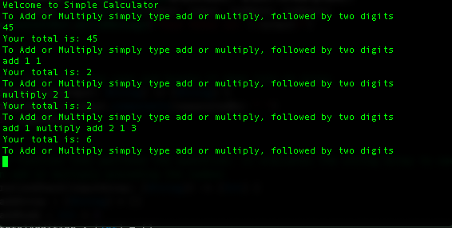

# SimpleCalcEncircle

Completed challenge for Encircle, attached is screenshot of the output of certain calculations

My thought process was to first find a way to take a string of letters and numbers and distinguish between them. Next, it was how to perform a BIDMAS type operation.

To distinguish between the letters and numbers I simply had to create a string extension that would return a boolean value on whether an element within an array was an Integer or now.

The operation itself was challenging in the sense that it wasn't the regular form of operation, it was a string followed y two numbers, but can easily have other operations within it. What I essentially did was find the index where there was a mention of add or multiply, if there was and there were two Integers after it, I would perform the respective operation. If there wasn't and there was another operation, that operation would take precedence and then I could continue. 

In conclusion, The calculator works well but I believe there are some things that could use some improvement, for example error handling or condensing the operation functions. 
